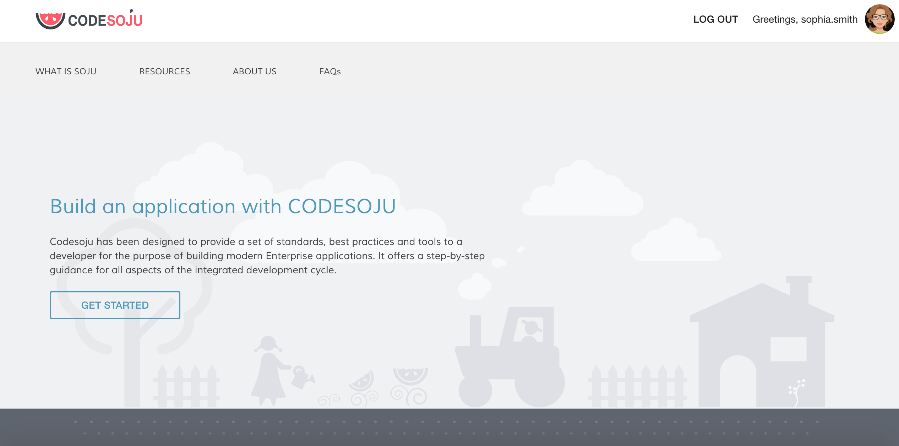

# <%= appName %>

# CodeSoju Generated Mobile App

</img>

## Add platforms
To be able to run your CodeSoju app either on a simulator and an actual device you have to add platforms of your choice. For iOS and Android run the following commands:
```
cordova platform add ios
```
```
cordova platform add android
```
## Set up native SDKs to develop and debug locally
For iOS you would need an Apple Development Account and xCode and for Android you would need an Android Studio. Read more about setting up your environment [**here**](https://cedrus.gitbooks.io/codesoju/content/native_mobile.html)
## Cofigure Base Url to communicate with the Node side

To be able to integrate your client mobile app with the backend, the backend has to be deployed somewhere. In this way you will be able to reach your Node side and your Node side will be able to reach all other third party services you might need. Once it is deployed you have to configure the base url which will point to where your backend lives. Otherwise there will be no frontend/backend communication possible.

We provide you with an example how to configure it in your CodeSoju app. As a deployment platform we will use IBM Bluemix. To deploy it to IBM Bluemix make sure you have the following:

1. Bluemix account
2. Cloud Foundry CLI tool

We have a helper operator to deploy your generated CodeSoju app to the Cloud Foundry. Run the following command:
```
yo codesoju:deploy-manifest
```
It will create a manifest file and add a cfignore file to your CodeSoju app which is required by the Cloud Foundry. Then run:
```
cf login
```
It will ask your credentials for your Bluemix account.
After specifying your organization and space just run:
```
cf push
```
It will deploy your CodeSoju app to the Bluemix. Navigate to your Bluemix dashboard. Find your app and copy its url. It will be your Base Url. Copy it and insert it in client/app.js file instead of <YOUR_BASE_URL>

Once it is done and your Base Url is configured, when you call Node side it should point to the deployed CodeSoju app and your client side should now be able to communicate with your backend.

## Update and run your CodeSoju app:

When you make changes to your CodeSoju app make sure to run:

- `gulp build-mobile`
- `cordova build`

And to start simulators you could run:
- `cordova run android`
- `cordova run ios`

For a better and more rich experience in building, compiling, running your app use iOS (xCode) and Android (Android Studio) SDKs directly.

## Development practices
- Work on issue/feature branches
- Pull request into develop branch when ready
- Pull request from develop branch into master branch periodically (after testing)

## Visit [**CodeSoju**](http://codesoju.io) for more information
